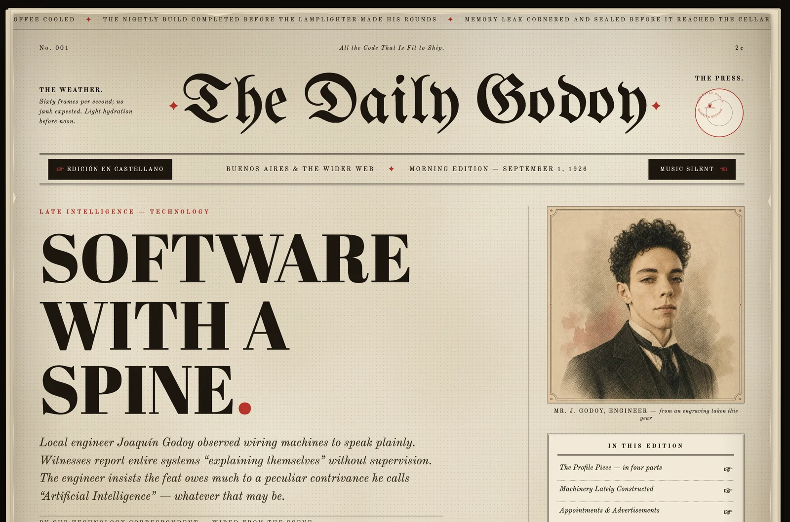

<div align="center">

# The Daily Godoy

**A software engineer's portfolio, printed as a 1926 broadsheet. Blackletter masthead, engraved portrait, a stock ticker across the top — and every headline is about code shipped in 2026.**

[](LICENSE)
[](https://astro.build/)
[](https://www.typescriptlang.org/)
[](https://biomejs.dev/)
[](https://railway.app/)

[](https://github.com/JoaccoG/portfolio-v2/actions/workflows/ci.yml)

**[▶ joaquingodoy.com](https://joaquingodoy.com)**



</div>

---

> All the code that is fit to ship.

**The Daily Godoy** is the personal site of Joaquín Godoy, laid out as the front page of a newspaper that went to press in 1926 — nameplate in blackletter, a weather box, a running ticker, an engraved portrait of the correspondent. Every story underneath is about software written in 2026. The furniture is period; the chronicle is current; the gap between the two is the whole joke.

It is one long broadsheet you scroll: a masthead that assembles itself on load, a pinned *Profile Piece* told in four parts, a hall of machinery where each project opens into its own inside page, a standing column with its own archive and index, a postmaster you can wire a telegram to, and a torn back page for anything that 404s. No framework runs the motion — the intro, the reveal, the custom cursor, the pinned scroll and the project drawers are a small hand-written engine. What React would carry, this carries itself.

## The type

Five faces, one of them cut by hand. **UnifrakturMaguntia** sets the nameplate, **Abril Fatface** the headlines, **Old Standard TT** the body columns, **Caveat** the marginalia. The fifth is **TDG Ornaments** — the pointing hands, the fleuron and the ticker's markers (`▼ ☜ ☞ ✦ ❦`). Those glyphs are the kind a browser renders from whatever the operating system happens to keep, so they land differently on every machine. So they were subset out of Noto Sans Symbols 2 with `pyftsubset` into a face that carries those five characters and nothing else — **4,476 bytes** — and prepended to every stack. Now a fleuron is a fleuron everywhere, not a tofu box on the one laptop that lacks it.

## Measured, not claimed

The paper is the whole atmosphere, and it nearly sank the frame rate. The mottle, grain and dots began as procedural SVG (`feTurbulence`) composited live — beautiful, and **raster-bound**: every scroll re-rasterised the turbulence, and the compositor throttled the page to a crawl. So the textures were baked once, in the browser, into opacity-folded WebP tiles and fused with a single `background-blend-mode: multiply` instead of a stack of `mix-blend-mode` layers — one raster per tile, no per-tile `saveLayer`. Same paper, measured back to the same speed as no paper at all, and the mobile textures that had been cut came back for free.

| paper pipeline | per-frame | scroll |
|:--|--:|--:|
| procedural SVG `feTurbulence`, live | ~33 ms | ~30 fps |
| textures off — the ceiling | ~8 ms | ~120 fps |
| **baked WebP + blend fusion — shipped** | **~15 ms** | **~65 fps** |

Taken on an Apple M1 Pro at DPR 2 in Chrome — wall-clock per frame from an inline probe, while actually scrolling. The shipped figure held on an external DPR-1 monitor and on an iPhone. It varies with the machine, which was exactly the point of baking them: a visitor is not owed an M-series to read a newspaper. The baked tiles are lossless on purpose — a lossy encode passed the eye but failed a wrap-around seam check, and a tile that doesn't seam wrecks a repeating background.

## The postmaster

The site is static except for two doors. The *Telegrams to the Editor* postcard wires a telegram through an on-demand route, [`/api/telegram`](src/pages/api/telegram.ts), and *Have the column wired to you* enters a subscriber in the Resend contact book through [`/api/subscribe`](src/pages/api/subscribe.ts); everything else is prerendered. There is no third-party form widget and no key in the browser.

Both routes rate-limit **before** they parse a body, each with its own counter. It keys on the last hop of `X-Forwarded-For` — the one Railway's proxy appends, which a client can't spoof, unlike the entries in front of it — with a per-IP window, a global ceiling that protects the Resend quota against IP rotation, and a bounded in-memory map that sweeps expired keys and evicts the oldest. The message goes out via [Resend](https://resend.com/) from a verified subdomain, and the API key lives only in the server environment, validated through `astro:env`. The counter is per-instance memory, so it is a courtesy bouncer, not a distributed one — named as such rather than oversold.

## The columns

Section D of the front page is *The Columns*, the paper's standing column, and it keeps its own archive at [`/columns`](https://joaquingodoy.com/columns). Each column is an MDX file in a typed collection — title, dek, headings, date and sign-off in the frontmatter, the prose underneath — with two pieces of period furniture for the body: an `<Aside>` for the notes ruled into the margin and a `<Figure>` for the plates, which open enlarged when pressed. Nothing else is written by hand. The roman numeral comes from the column's place in the archive, the year block from its date (shown a century behind, like every date on the paper), the reading time and the word count from the body itself. The feed filters by heading and keeps the filter in the address, and the archive is set on a third sheet of paper, mottled with its own seed so it never reads as the front page reprinted.

## Reads on paper

It is a newspaper, so it prints like one. `@media print` clears the cursor, the ticker, the music toggle and the drawers, drops the textures to plain white stock and reflows the broadsheet into about five clean A4 pages. `Ctrl-P` is a feature, not an afterthought.

## Running locally

```bash
npm install
npm run dev          # http://localhost:4321
```

```bash
npm run build        # static pages + node server → dist/
npm run check        # astro check — types and templates
npm run lint         # biome check .
npm run format       # biome format --write .
```

The postmaster needs a Resend key to actually send; everything else runs without one.

## Environment

Three variables, in `.env` locally and in the host's dashboard in production. See [`.env.example`](.env.example):

```bash
RESEND_API_KEY=re_your_api_key_here
RESEND_FROM=The Daily Godoy <telegrams@mail.yourdomain.com>
RESEND_SEGMENT_ID=
```

All three are declared in the `astro:env` schema and validated at build. `RESEND_FROM` carries a safe default (`onboarding@resend.dev`) and `RESEND_SEGMENT_ID` is optional — set it to file subscribers under a Resend segment, leave it empty and they go in the book unfiled — so the site builds and runs without any of them; it just can't post a telegram or enter a subscriber until the key is set.

## Deploy

A multi-stage [`Dockerfile`](Dockerfile) (node:22-alpine) builds the site and runs the Node standalone server, serving on `$PORT`. It ships to [Railway](https://railway.app/), or any Docker host:

```bash
docker build -t daily-godoy .
docker run -p 8080:8080 daily-godoy   # → http://localhost:8080
```

## Built with

**[Astro 7](https://astro.build/)** with the Node standalone adapter and `@astrojs/sitemap`, **TypeScript** in strict mode and **Biome** for lint and format. Images run through Astro's `<Image>` and `sharp`; the projects are a typed content collection (Zod-validated JSON) and the columns another (MDX under a Zod frontmatter), with the copy in an i18n bundle — a Spanish edition is on the way. All the motion is the hand-written engine under [`src/engine/`](src/engine); the mail is Resend. CI runs Biome, `astro check` and the build on every push.

## License

[MIT](LICENSE) © 2026 Joaquín Godoy, for the design and the engineering. The editorial content and the portrait are the author's own.
